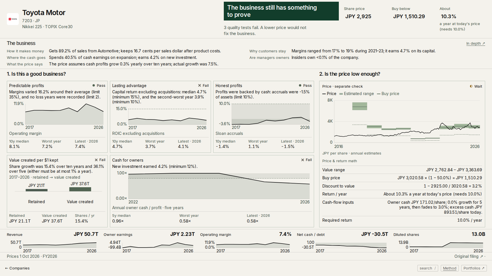
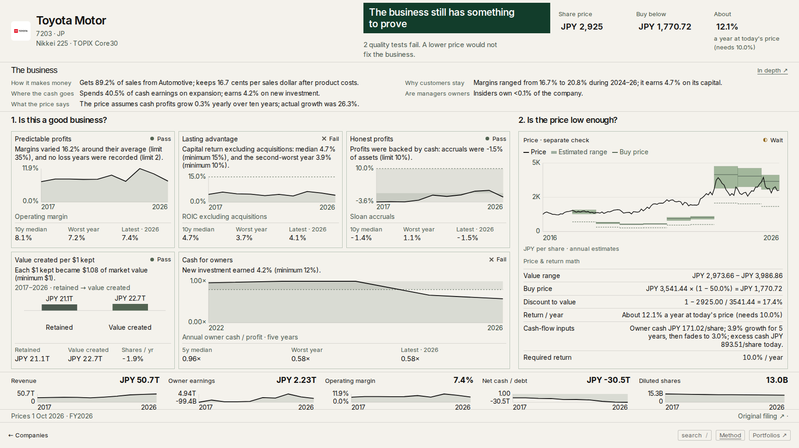
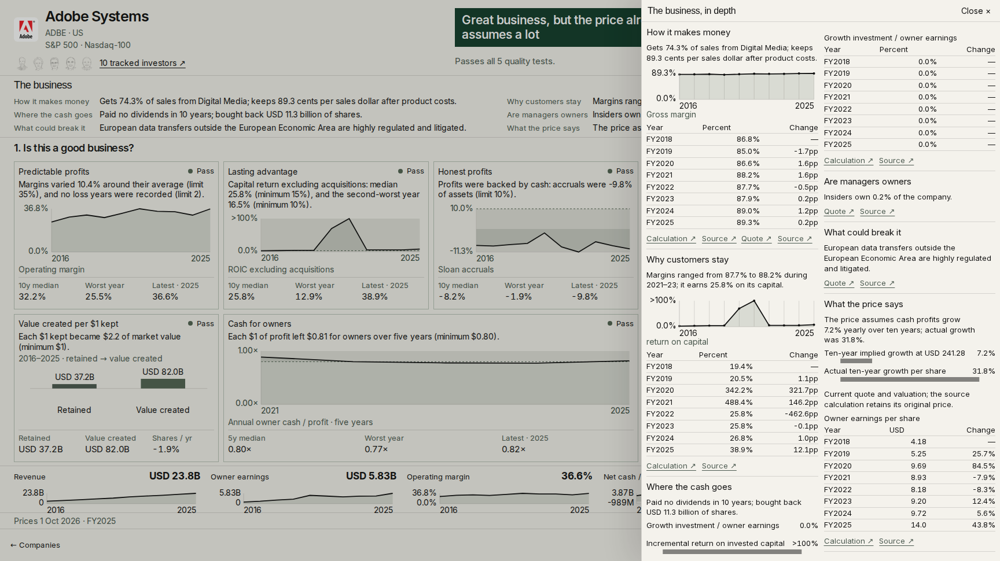
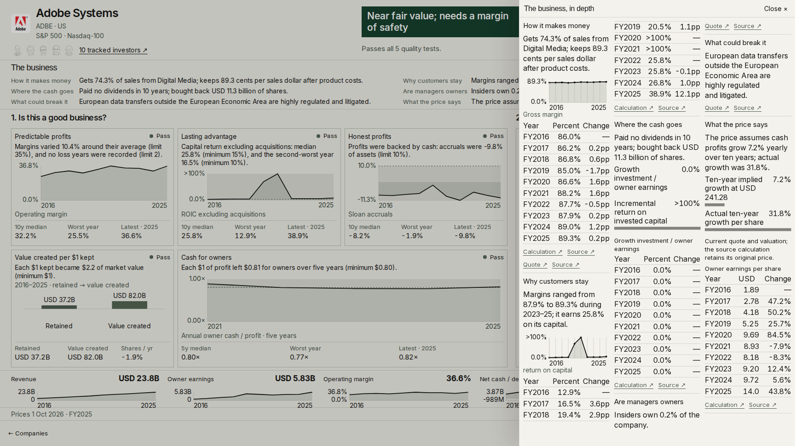

# Fix 5 report — local verification

Resumed from `c24593d` on 2 October 2026. Task 1 remains complete in `df131d7` (`value: nightly publish keeps quarters and memo`); the daily runner remains on that commit. No push, deployment, remote data publication, subagents, or research-file edits were performed.

## Tasks 2–5

- Split normalization is shared by ingestion, current analysis, price-history reading and quarterly generation. It follows observed comparative-basis transitions, including temporary original/restated blocks, rather than applying a date cutoff to every year. Cached EODHD actions and issuer-confirmed actions supply factors. EPS, dividends and issued shares are adjusted only when their own basis agrees, preserving already-restated values and real dilution. Raw source files are unchanged. The pipeline version is incremented so normal analysis refreshes cached results.
- Toyota's ten/five-year share growth changed from **+15.4% / +36.1%** to **−1.9% / −1.4%**. Management changes from fail to pass; two other quality tests still fail. Its FY2018 midpoint changes from **JPY 6,921.38 to 1,369.12**, on the same unit basis as the price line. Current midpoint is JPY 3,541.44; these historical values still use current rates and restated filings.
- Quality-pass companies priced at or below value, above their buy threshold, say **“Near fair value; needs a margin of safety”** (8 words). “Assumes a lot” requires price above value. Adobe remains USD 241.28 versus value 245.23 and buy price 208.44; the valuation and underlying tests are unchanged.
- Adobe's FY2020/2021 ROIC values remain 3.4224555735 and 4.8844488828 internally. The memo annual table now uses the same **>100%** formatter as charts and summaries, and omits change precision when either endpoint exceeds 100%. The quality rules retain their original basis, including conservative fallback treatment of nonpositive capital.
- Computed Q2 uses the latest three consecutive fiscal years on the published analysis: Adobe **2023–25**, Toyota **2024–26**. Missing years do not get bridged. Publication refreshes this computed line without modifying filing-based research or the parallel backfill files.
- Memo tables show five annual rows on short desktop screens and the latest decade on taller screens. The panel fitter compares type size with column width for text-only tables, bounds width expansion, and allows compact spacing where tall-screen annual bars add row height. The 13px minimum remains unchanged. This addresses the memo whitespace failures exposed by the four-viewport gate.

## Adobe denominator check

The denominator is small and positive, not negative. Figures are USD millions. The inputs agree with [Adobe's FY2021 10-K](https://www.sec.gov/Archives/edgar/data/796343/000079634322000032/adbe-20211203.htm), including the FY2020 comparative column. Debt below includes operating leases; they are not added twice. Cash includes short-term investments. Operating intangibles remain in capital; the calculation subtracts goodwill.

| Fiscal year | Equity | Debt + leases | Cash + investments | Goodwill | Capital | NOPAT | Raw return |
|---|---:|---:|---:|---:|---:|---:|---:|
| 2020 | 13,264 | 4,708 | 5,992 | 10,742 | 1,238 | 4,237 | 342.25% |
| 2021 | 14,797 | 4,673 | 5,798 | 12,668 | 1,004 | 4,904.0 | 488.44% |

FY2020's tax benefit is clamped to zero in the existing NOPAT calculation. These ratios were arithmetic consequences of the denominator, not a percentage-unit conversion bug. The display correction does not award a pass below a numerical hurdle.

## Ten filing spot-checks

Each issuer filing below confirms the action's unit factor. The sample is an actual annual denominator from the corpus, before and after normalization (billions of shares); these weighted-average/derived observations are not presented as the issuer's period-end issued count. Legal effective dates can follow the exchange ex-date. Toyota's 29 September ex-date versus 1 October effectiveness is covered by a regression test.

| Company | Filing-confirmed action | Sample fiscal year | Shares before → after (bn) |
|---|---|---:|---:|
| [Toyota (7203.JP)](https://www.sec.gov/Archives/edgar/data/1094517/000119312521158248/d158831dex996.htm) | 5:1; 1 October 2021 | 2013 | 3.166885 → 15.834425 |
| [Fujifilm (4901.JP)](https://ir.fujifilm.com/en/investors/ir-news/auto_20240430580130/pdfFile.pdf) | 3:1; 1 April 2024 | 2013 | 0.481734 → 1.445201 |
| [Mitsubishi (8058.JP)](https://www.mitsubishicorp.com/jp/en/ir/sh_meeting/pdf/other_2024.pdf) | 3:1; 1 January 2024 | 2013 | 1.832670 → 5.498010 |
| [Tokio Marine (8766.JP)](https://www.tokiomarinehd.com/en/newsroom/topics/2022/k82ffv000000dnb6-att/20220720_Capital_Issues_Notification_to_SH_e.pdf) | 3:1; 1 October 2022 | 2013 | 0.767051 → 2.301154 |
| [MS&AD (8725.JP)](https://www.ms-ad-hd.com/en/ir/library/disclosure/main/015/teaserItems2/0/link/MSAD2024_E.pdf) | 3:1; 1 April 2024 | 2013 | 0.621932 → 1.865797 |
| [Sompo (8630.JP)](https://www.sompo-hd.com/-/media/hd/en/files/doc/pdf/annualreports/2024/annualreport2024_2.pdf?la=en) | 3:1; 1 April 2024 | 2013 | 0.415014 → 1.245043 |
| [AGC (5201.JP)](https://www.agc.com/en/ir/library/financial/pdf/financial2016e.pdf) | 1:5; 1 July 2017 | 2012 | 1.155919 → 0.231184 |
| [Mitsui (8031.JP)](https://www.mitsui.com/jp/en/ir/library/meeting/pdf/en_243_4q_KB.pdf) | 2:1; 1 July 2024 | 2013 | 1.894579 → 3.789159 |
| [Sumitomo Mitsui Trust (8309.JP)](https://www.smth.jp/english/-/media/th/english/investors/financial_report/2023/frsmth.pdf) | 2:1; 1 January 2024 | 2016 | 0.385204 → 0.770408 |
| [NH Foods (2282.JP)](https://www.nipponham.co.jp/eng/ir/library/annual/pdf/2022_annual/annual2022_06_e.pdf) | 1:2; 1 April 2018 | 2013 | 0.207240 → 0.103620 |

## Universe changes

The audit checks all **2,708** published dossiers, with no additions or removals. It covers numerical rules and each verdict's price/value relation. There are **56 affected companies: 22 with changed test payloads, seven with pass/fail changes, and 34 with changed verdict wording**. The table lists every company with a changed test payload (including metrics/series/reasons), verdict wording, or buy flag. “Same outcome” means the test's evidence or numbers changed without flipping its pass/fail result. Full machine-readable evidence: `.fix5/universe-audit.json`; normalization/replay evidence: `.fix5/replay.json`.

The replay uses the normal analysis stage and current cached completeness sources. Consequently, outcome changes in other tests can reflect recomputation of existing source corrections as well as share-unit repair; they are disclosed rather than attributed solely to splits.

| Company | Changed tests | Outcome changes | Verdict change |
|---|---|---|---|
| 5201.JP — AGC Inc. | understandable, moat, economics, management, accounting | Same outcome | — |
| SHRIRAMFIN.NSE — Shriram Finance Ltd. | understandable, moat, economics, management, accounting | Same outcome | — |
| 8630.JP — Sompo Holdings, Inc. | understandable, moat, economics, management, accounting | economics: fail → pass; management: fail → pass | — |
| ACN.US — Accenture plc | — | — | Near fair value; needs a margin of safety |
| 4661.JP — ORIENTAL LAND CO.,LTD. | understandable, moat, economics, management, accounting | Same outcome | — |
| PLUS.LSE — Plus500 Ltd | — | — | Near fair value; needs a margin of safety |
| 4901.JP — FUJIFILM Holdings Corporation | understandable, moat, economics, management, accounting | Same outcome | — |
| FDS.US — FactSet Research Systems Inc | — | — | Near fair value; needs a margin of safety |
| VIVT3.SA — Telefônica Brasil S.A. | price | Same outcome | — |
| WFC.US — Wells Fargo & Company | — | — | Near fair value; needs a margin of safety |
| 259960.KO — Krafton Inc | — | — | Near fair value; needs a margin of safety |
| RTO.LSE — Rentokil Initial PLC | — | — | Near fair value; needs a margin of safety |
| SGO.PA — Compagnie de Saint-Gobain S.A. | — | — | Near fair value; needs a margin of safety |
| 6981.JP — Murata Manufacturing Co., Ltd. | understandable, moat, economics, management, accounting | Same outcome | — |
| TD.TO — Toronto Dominion Bank | — | — | Near fair value; needs a margin of safety |
| BEL.NSE — Bharat Electronics Ltd. | management | Same outcome | — |
| 8031.JP — MITSUI & CO., LTD. | understandable, moat, economics, management | understandable: pass → fail | — |
| ACGL.US — Arch Capital Group Ltd. | — | — | Near fair value; needs a margin of safety |
| MTB.US — M&T Bank Corporation | — | — | Near fair value; needs a margin of safety |
| PNC.US — PNC Financial Services Group Inc | — | — | Near fair value; needs a margin of safety |
| AZO.US — AutoZone Inc | — | — | Near fair value; needs a margin of safety |
| 8058.JP — Mitsubishi Corporation | understandable, moat, economics, management, accounting | understandable: pass → fail; economics: pass → fail | — |
| 8001.JP — ITOCHU Corporation | understandable, moat, economics, management, accounting | understandable: pass → fail; economics: pass → fail | — |
| EG7.IR — FBD Holdings PLC | — | — | Near fair value; needs a margin of safety |
| ELV.US — Elevance Health Inc | — | — | Near fair value; needs a margin of safety |
| ALL.US — The Allstate Corporation | — | — | Near fair value; needs a margin of safety |
| 600519.SHG — Kweichow Moutai Co Ltd | — | — | Near fair value; needs a margin of safety |
| ADBE.US — Adobe Systems Incorporated | — | — | Near fair value; needs a margin of safety |
| GIB-A.TO — CGI Inc | — | — | Near fair value; needs a margin of safety |
| PETR3.SA — Petroleo Brasileiro Petrobras SA ADR | understandable, moat, economics, management, accounting, price | Same outcome | — |
| SNA.US — Snap-On Inc | — | — | Near fair value; needs a margin of safety |
| BSE.NSE — BSE Ltd. | understandable, moat, economics, management, accounting, price | Same outcome | — |
| HIG.US — Hartford Financial Services Group | — | — | Near fair value; needs a margin of safety |
| FITB.US — Fifth Third Bancorp | understandable, moat, economics, management, accounting, price | Same outcome | — |
| T6W.F — Thai Beverage Public Company Limited | — | — | Near fair value; needs a margin of safety |
| WOR.AU — Worley Ltd | — | — | Near fair value; needs a margin of safety |
| NA.TO — National Bank of Canada | — | — | Near fair value; needs a margin of safety |
| BNS.TO — Bank of Nova Scotia | — | — | Near fair value; needs a margin of safety |
| CAP.PA — Capgemini SE | — | — | Near fair value; needs a margin of safety |
| BR.US — Broadridge Financial Solutions Inc | — | — | Near fair value; needs a margin of safety |
| 9843.JP — Nitori Holdings Co., Ltd. | understandable, moat, economics, management, accounting | Same outcome | — |
| 5401.JP — NIPPON STEEL CORPORATION | understandable, moat, economics, management, accounting | Same outcome | — |
| 9984.JP — SoftBank Group Corp. | understandable, moat, economics, management, accounting | management: pass → fail | — |
| 027410.KO — BGF Retail Co Ltd | understandable, moat, economics, management, accounting | Same outcome | — |
| KBC.BR — KBC Groep NV | — | — | Near fair value; needs a margin of safety |
| SOP.PA — Sopra Steria Group SA | — | — | Near fair value; needs a margin of safety |
| BAJAJFINSV.NSE — Bajaj Finserv Ltd. | management | Same outcome | — |
| ULTA.US — Ulta Beauty Inc | — | — | Near fair value; needs a margin of safety |
| CB.US — Chubb Ltd | — | — | Near fair value; needs a margin of safety |
| NOKIA.HE — Nokia Oyj | understandable, moat, economics, management, accounting | Same outcome | — |
| 2282.JP — NH Foods Ltd. | understandable, moat, economics, management, accounting | understandable: pass → fail | — |
| BRK-B.US — Berkshire Hathaway Inc | — | — | Near fair value; needs a margin of safety |
| DEVL.F — DBS Group Holdings Ltd | — | — | Near fair value; needs a margin of safety |
| DPZ.US — Domino's Pizza Inc Common Stock | — | — | Near fair value; needs a margin of safety |
| 7203.JP — TOYOTA MOTOR CORPORATION | moat, management | management: fail → pass | — |
| 9999.HK — NetEase Inc | — | — | Near fair value; needs a margin of safety |

Share normalization found changes in these 29 published companies (some older observations do not change current test payloads): 5201.JP, SHRIRAMFIN.NSE, 8630.JP, 8309.JP, 4661.JP, 4901.JP, MYCR.ST, VIVT3.SA, 8766.JP, 6981.JP, BEL.NSE, 8031.JP, 8058.JP, 8001.JP, PETR3.SA, 8750.JP, BSE.NSE, FITB.US, 9843.JP, 5401.JP, 9984.JP, 027410.KO, 9602.JP, BAJAJFINSV.NSE, NOKIA.HE, 8725.JP, 2282.JP, 7203.JP, 7532.JP.

## Verification

- Full unit suite: **171 files passed; 1,801 tests passed, one existing skip**. One run concurrent with static-page generation timed out in a runner integration test; the complete suite passed after the build finished. The nine task-specific regression tests also passed after the table/fitter changes.
- Consistency audit: **55/55 companies passed, zero failures**. Its store-wide checks covered **2,708 dossiers, 13,145 quality rules, 1,970 return checks and 41 cash-covered cases**.
- Universe verdict/memo audit: **zero failures**, no added/removed dossiers; all **2,221** dated computed Q2 answers end at the published analysis's latest fiscal year.
- Local production build: **passed**, including TypeScript and 8,218 static paths; incremental webpack build reused `.next`.
- Final release gate: **537/537 states passed, zero failures**, on the same local production build:

| Viewport | States | Failures |
|---|---:|---:|
| 1728×970 | 135 | 0 |
| 2056×1180 | 135 | 0 |
| 1440×800 | 135 | 0 |
| 390×844 | 132 | 0 |

Gate reports: `.fix5/release-passed/<viewport>/report.json`. Earlier gate runs exposed memo whitespace failures; all were resolved without changing the gate. Final screenshots were captured at 1728×970 from this build.

Disk: approximately **0.9 GB new retained files**, including the incremental `.next` growth, isolated store, audit logs and screenshots; **about 10 GiB free** at completion. Builds stayed in `.next`; the monitored build and browser checks never crossed the 6 GiB stop threshold.

Verification logs and JSON reports are retained under `.fix5/`. Browser screenshots were opened and inspected for home, Buy now, Next closest, filters, 2011, a buy dossier, Adobe, Alphabet, Coca-Cola, JPMorgan and their evidence/memo drawers. The gate's original thresholds were not changed.

The isolated verification corpus is `.fix5/corpus`; normal `publish --out` writes `.fix5/store`. It contains all 87 quarters, 87 global and western perQuarter summaries, and generated browser views. The 29 affected companies produced 751 rebuilt quarterly rows with zero generation failures; no shared corpus history was overwritten. The daily runner's existing quarterly preservation remains intact.

## Before / after — 1728×970

### Toyota dossier

Before:

After:

### Adobe dossier

Before:

After:

### Adobe memo drawer

Before:

After:

Toyota memo before/after are also saved in `fix-5-shots/`.
