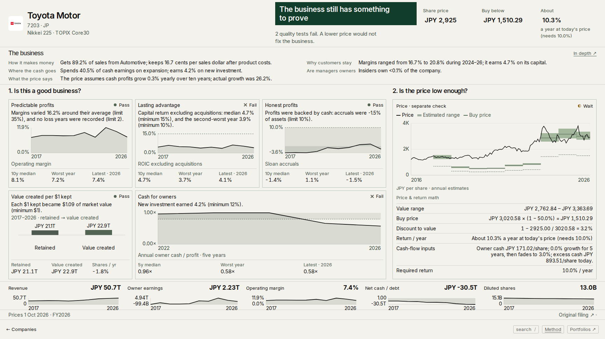
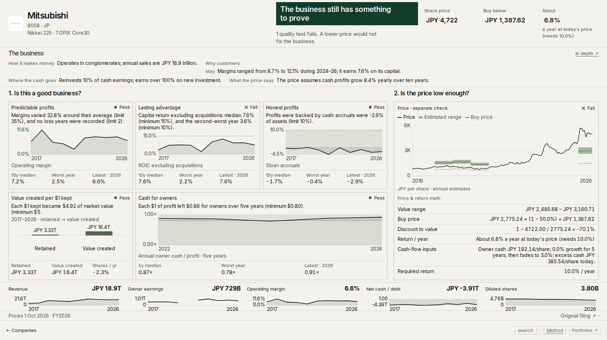

# Fix 5c — split repair constrained to published share units

Local correction of rejected `cb8c36e`, 2 October 2026. **Disk-stop checkpoint: final desktop/browser verification remains incomplete; do not release.** No push, deployment, remote publication, subagents, or backfill-1 research edits.

## Cause and filing check

The rejected replay called the full `analyze` stage for split-affected source histories. This refreshed secondary-source fields, balances, periods, rates and derived values instead of isolating share units. In `completeCachedYears` → `fillYears` → `deriveYears`, an existing `operatingIncome` with derived EBIT-proxy provenance could be recalculated using a **different formula**. Secondary-listing `operatingExpenses` included cost of sales; subtracting that total from gross profit counted cost of sales twice. The corrupted income also entered NOPAT, ROIC and ROIIC.

[Mitsubishi’s FY2025 annual financial report](https://www.mitsubishicorp.com/jp/en/ir/library/afr/assets_r24/pdf/afr2025.pdf), printed pages 38 and 41, confirms FY2024 revenue ¥19,567,601m, cost of revenues ¥17,207,892m, gross profit ¥2,359,709m and SG&A ¥1,692,282m. The secondary expense total ¥18,900,174m equals cost of revenues plus SG&A. Gross profit minus SG&A is ¥667,427m; subtracting the combined expense total instead produces the impossible −¥16,540,465m used by the rejected replay.

The live basis is a **proxy**, not an issuer-reported operating-profit subtotal: profit before tax ¥1,362,594m plus cash interest paid ¥212,823m = ¥1,575,417m, or 8.0512% of revenue. The source tag is `InterestPaidOpeCFIFRS`. The income statement separately reports finance costs ¥191,141m. This release preserves the existing, reproducible proxy and does not relabel it as precise accrued EBIT or replace it with gross profit less SG&A. Any such methodology change is separate from a stock-split repair.

| Company | FY2024 live proxy margin | Rejected replay | Fix 5c | Live → rejected → fixed ROIIC |
|---|---:|---:|---:|---|
| Mitsubishi 8058.JP | 8.0512% | −84.5299% | 8.0512% | 1.6160678657 → −22.7920809804 → 1.6160678657 |
| ITOCHU 8001.JP | 8.5271% | −79.0235% | 8.5271% | 1.000001 → 0 → 1.000001 |
| Mitsui 8031.JP | 11.0354% | −86.1527% | 11.0354% | 0.9271365892 → −9.7812135906 → 0.9271365892 |

`deriveYears` now refreshes an existing EBIT proxy from its original pretax-income/interest inputs. A regression test first reproduced Mitsubishi’s −¥16,540,465m result, then passed with the repair; it also proves that changing a proxy input still refreshes the proxy.

## Frozen baseline and universe guard

The release script now starts from **all 2,708 live dossiers in `~/value-corpus/publish-repo`**, not an earlier staging snapshot. It reconstructs the already-published denominator before normalizing mixed share bases, so previously corrected histories are not split twice. Per-share observations are scaled directly from published values; their numerators never come from a new source replay. Dependent metrics use the same published observations. Sompo’s annual retained-per-share inputs must reproduce the live aggregate before the script permits its unit conversion.

The guard compares exact serialized JSON values, with no numeric tolerance. Unknown series and metrics are protected by default. It covers dossier and test series, test metrics, raw metrics, the entire current valuation, basis/window metadata, memo return charts and capital-allocation totals. The explicit dependency allowance is confined to shares, per-share observations/returns, market caps derived from shares, and their growth/retention/buyback-yield metrics. Current valuations remain entirely identical to live.

| Protected payloads | Differences in rejected store | Remaining differences |
|---|---:|---:|
| Dossier non-per-share series | 56 | 0 |
| Test non-per-share series | 45 | 0 |
| Test non-per-share metrics | 66 | 0 |
| Non-per-share raw metrics | 418 | 0 |
| Current valuation payloads | 19 | 0 |
| Other protected test/basis/window payloads | 10 | 0 |
| **Core-series/metric total** | **614 across 29 companies** | **0** |

**215,622 protected payload comparisons; 2,708 dossiers; zero additions, removals or unexplained differences. Remaining-difference list: empty.** Revenue, margins, ROIC/ROIIC, accruals, owner-earnings totals, cash, capital-return calculations and all current valuation inputs match live. This includes every controller-named company: 8058, 8001, 8031, Sompo, PETR3, BSE, FITB, AGC, Murata, Oriental Land and Nitori.

A final sweep of memo charts also caught TLC.AU’s return-on-capital observations being emptied and 4DX.AU’s being removed with a stale Q2 sentence. Their published observations are now preserved, and the guard protects all memo chart observations and capital-allocation totals. Empty chart shells contain no observations; eight stale Q2 sentences with empty charts are removed where no current numerical answer can be produced. The rejected-store memo differences were not separately captured before that store was replaced; the 614 above counts its preserved core-series/metric audit. Final memo-series differences: **zero**.

Machine-readable evidence: `.fix5c/rejected-scope.json`, `.fix5c/scope-audit.json`, `.fix5c/replay.json` and `.fix5/universe-audit.json`. Reproduce with:

```sh
node --import tsx scripts/value/fix-5-stage.ts
node --import tsx scripts/value/fix-5-scope-audit.ts
node --import tsx scripts/value/fix-5-audit.ts
node --import tsx scripts/value/fix-5-history.ts
```

The source-history scan still identifies the original 29 split candidates; only six require further unit changes on the **published** basis: Sompo, Toyota, Nitori, BGF Retail, FITB and Nokia. The other 23 retain their already-adjusted published units. FITB/Nokia changes are confined to older per-share observations. Nitori’s FY2022–23 denominator changes 5×, changing its share-derived buyback-yield evidence without flipping a test. BGF’s FY2016 action changes per-share endpoint evidence without flipping a test.

The prior quarterly replay also changed unrelated historical quality tests. All **111 live history files, including 87 quarterly frames and their summaries, are retained byte-for-byte** in this release. They are not claimed as newly repaired backtests. Dossier annual per-share/value-history charts are repaired separately; no full source recomputation is permitted by the history script.

## Every test flip and its cause

There are **three flips in two companies**, down from the rejected replay’s unrelated failures:

| Company / test | Flip | One-line cause |
|---|---|---|
| Toyota 7203.JP — management | fail → pass | Its 5:1 split changes ten/five-year share growth from +15.37%/+36.06% to −1.78%/−1.39%; the dilution bar now passes. |
| Sompo 8630.JP — economics | fail → pass | Its 3:1 split changes book-plus-dividend compounding from 6.07% to 18.39%, above the unchanged 7% bar. |
| Sompo 8630.JP — management | fail → pass | Its 3:1 split changes ordinary share growth from +8.47% to −2.81%; corrected book gain ¥4,307.09 exceeds retained earnings ¥877.31 per share. |

Only four companies have changed test payloads: Toyota management; Sompo economics/management; Nitori management; BGF management. Mitsubishi, ITOCHU and Mitsui’s former non-per-share flips are gone, as are NH Foods and SoftBank’s unrelated flips. Toyota still fails two quality tests; Sompo’s other tests retain their live results. No buy flag changes.

Toyota’s FY2018 midpoint is **JPY 6,921.38 → 1,384.28**, exactly the published value divided by five. The rejected replay’s JPY 1,369.12 included unrelated recomputation and is superseded. Current Toyota midpoint **JPY 3,020.58** is retained from live; the rejected replay’s JPY 3,541.44 is also superseded. All current Adobe valuation inputs are unchanged.

There are **38 companies with changed test payloads or verdict wording**, including **34 wording-only changes** to “Near fair value; needs a margin of safety”. The audit verifies all price/value relations and numerical verdict bars with zero failures. Adobe remains USD 241.28 versus value USD 245.23 and buy price USD 208.44. Computed Q2 text uses the latest three published fiscal observations; filing-based memo answers and backfill research are untouched.

Wording-only IDs: ACN.US, PLUS.LSE, FDS.US, WFC.US, 259960.KO, RTO.LSE, SGO.PA, TD.TO, ACGL.US, MTB.US, PNC.US, AZO.US, EG7.IR, ELV.US, ALL.US, 600519.SHG, ADBE.US, GIB-A.TO, SNA.US, HIG.US, T6W.F, WOR.AU, NA.TO, BNS.TO, CAP.PA, BR.US, KBC.BR, SOP.PA, ULTA.US, CB.US, BRK-B.US, DEVL.F, DPZ.US, 9999.HK.

## Verification

**Stopped under the user's disk rule; final release verification is incomplete.** The release-gate and consistency processes raised `DISK STOP: below 6 GiB` on the last run. No further verification was started after the stop, even though free space subsequently recovered. This commit is not a release-ready claim.

- Final full unit suite: **172 files passed; 1,805 tests passed, one existing skip**, with `npm test -- --maxWorkers=2` (`.fix5c/unit-final.log`). An earlier overlapping run hit three existing 5-second test timeouts; the passing run retained those timeouts and reduced worker contention.
- Final production build: **passed**, including TypeScript and **8,219 static pages**, with `next build --webpack`; output only in `.next` (`.fix5c/build.log`).
- Final universe scope: **2,708 dossiers; 215,622 protected comparisons; zero differences**. Universe verdict/Q2 audit: **zero failures**, including 2,227 computed memo windows. Retained-history audit: **111 files / 87 quarters, zero differences**.
- Final storewide consistency phase: **2,708 dossiers, 13,145 quality-rule checks, 1,970 return checks, 41 cash-covered valuations**, all passed. Browser cross-surface phase: **5 companies passed before the disk stop**, no observed assertion failures; incomplete against the required 55.
- The preceding build completed the full **581-state / four-viewport gate with zero failures** and **55/55 browser consistency checks**. That result predates the final TLC/4DX memo-chart preservation and expanded guard. It is historical evidence, not substituted for final verification.

| Final viewport | States passed | Observed failures | Completion |
|---|---:|---:|---|
| 1728 × 970 | 102 | 0 | Stopped at disk floor |
| 2056 × 1180 | 94 | 0 | Stopped at disk floor |
| 1440 × 800 | 104 | 0 | Stopped at disk floor |
| 390 × 844 | 143 | 0 | Complete |

The final phone gate is complete. **Remaining before release: complete the three desktop gates and all 55 browser consistency checks against this final build.** Gate thresholds and audit rules were not relaxed. Current logs are `.fix5c/final-<viewport>.log` and `.fix5c/consistency-final.log`; completed desktop reports from the preceding build are labelled `report.previous-build.json` to avoid treating them as final.

The requested Toyota, Adobe and Mitsubishi page screenshots were captured from the final build at 1728×970 and visually inspected. Home, Buy now/Next closest drawers, country filter, 2011 time travel, Lululemon, GOOGL, KO, JPM, their business drawers and Mitsubishi valuation were also inspected during the gate passes.

Restoring the published dataset exposed layout assumptions in the business and sparse valuation drawers. The business fit now uses spare room for readable text while retaining a compact fit when possible. Short valuation histories use labelled rows. These changes repaired the measured gaps without relaxing the gate. The replay also retains live search shards.

The build monitor checks disk every five seconds and tolerates files disappearing during Next.js output replacement. Monitored peak task growth was **331 MB**. Superseded generated screenshots were removed, retaining final evidence and requested images; final retained growth is approximately **151 MB**. Free space recovered to **9.11 GiB** by report creation, but the disk-stop instruction remains honored. No dependencies were installed; no build output was placed outside `.next`.


## Screenshots — 1728×970

Toyota:


Adobe:


Mitsubishi:

