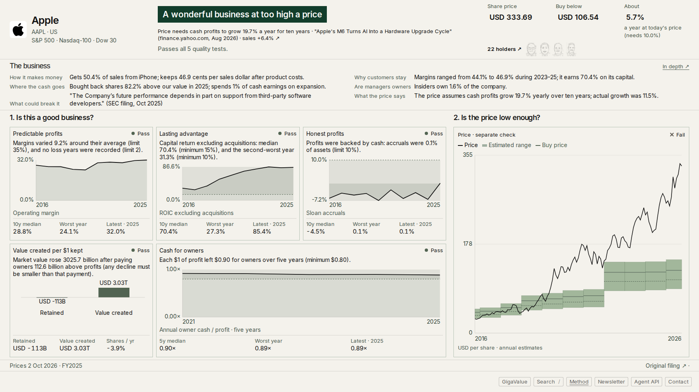
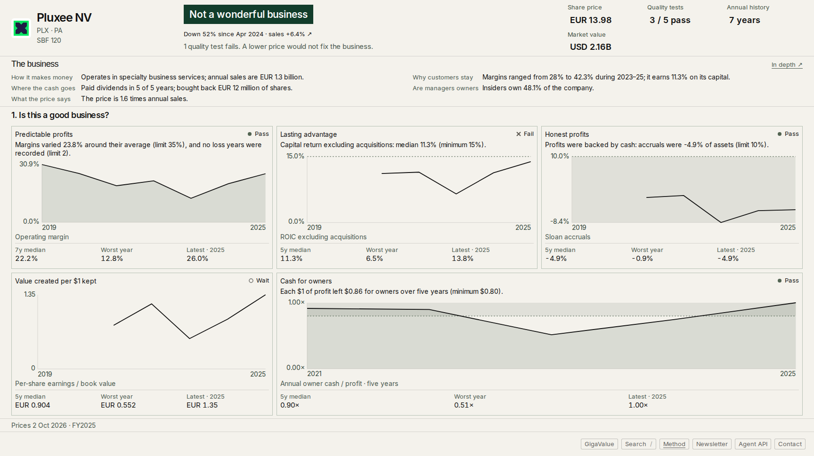
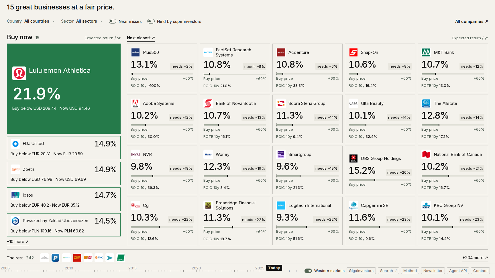
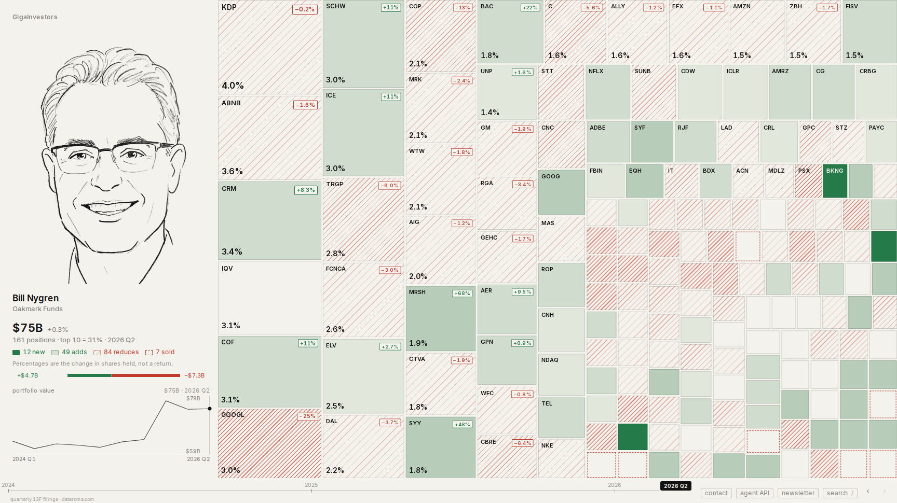
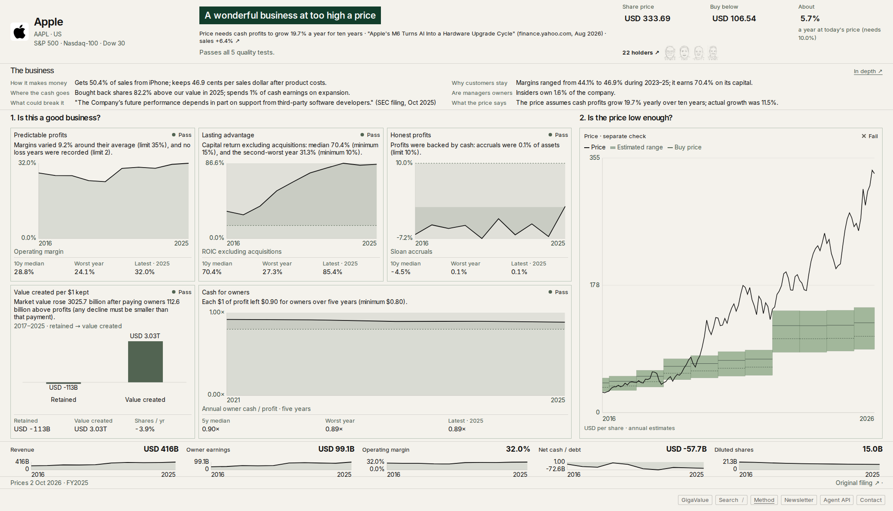
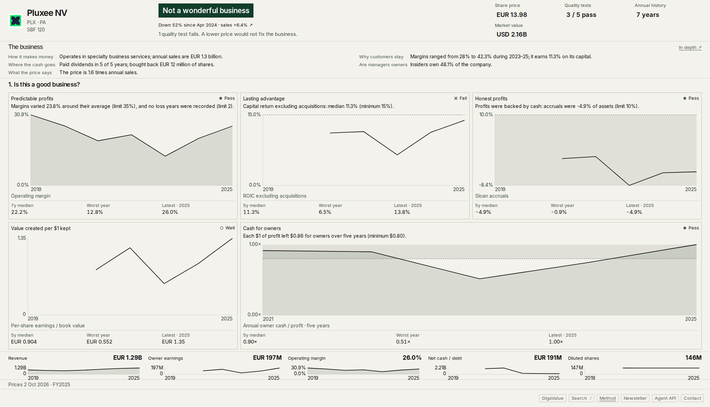
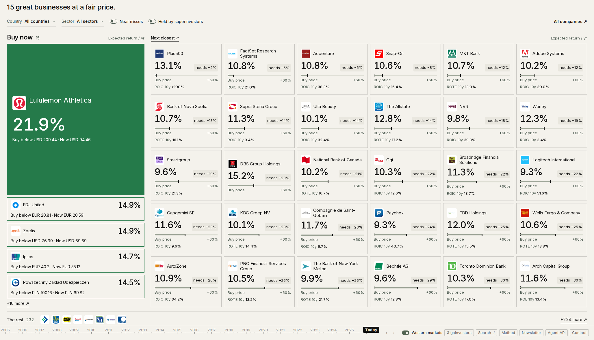
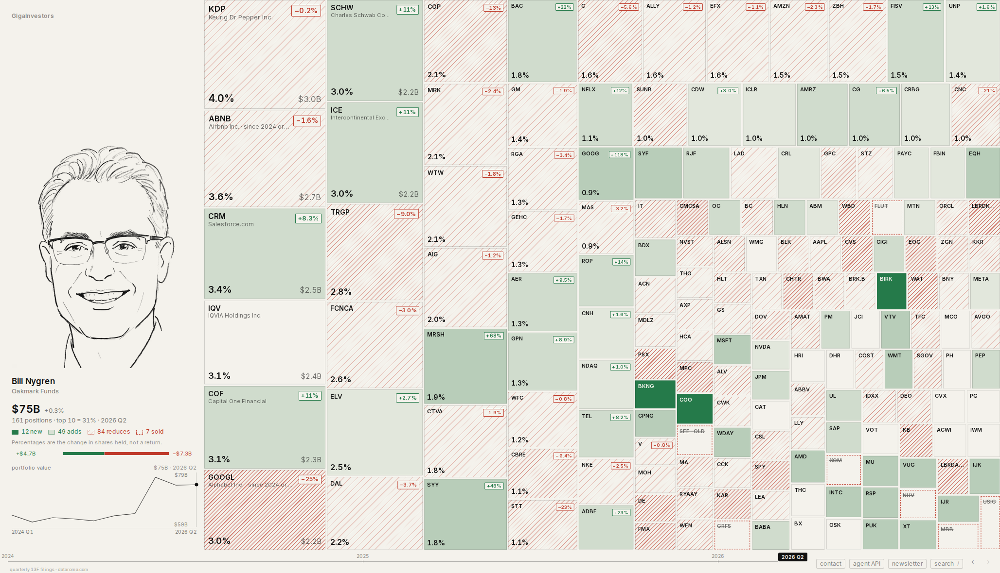

READY

Owner fixes after the one-site release · 2026-10-04. All requested fixes are implemented and verified.

The code commit containing this report is based on `3c7ffc1`. Investor reference: `9ebf2c7`. This is a code-only handoff; the temporary data snapshot described below is a comparison fixture, not a data publication.

## Four requested changes

1. Removed the root brand header and its reserved 32 px. `/value`, merged company pages and Method have no added brand mark. Restored the original brand links on investor pages, legacy stock fallback pages, About, Newsletter, Privacy, Unsubscribe, Munger and the 404 page. Preserved their original 12 px type. The home investor grid uses the recovered height.
2. The bottom-bar link to `/value` uses `VALUE_PRODUCT_NAME` (`GigaValue`). The reverse product link says `GigaInvestors`. Reviewed every new button/label in the release diff; internal checklist terminology is not used as a product-navigation label.
3. Restored the investor components, portrait assets, tiles, colours, text, verdict-free marks, chart and quarter behaviour, search and original bottom bar. The new global styles and shared dock exclude investor routes. Original rendering components are isolated in `components/investor-legacy`. The bar and chart keep their original markup/styles; their selected markers paint before portfolio work to meet the timing gate. [Source preservation](merge-fix-1/source-preservation.json).
4. Company HTML always shows today, including old compact/spaced `?q` links and 13F-only fallback stocks. Removed the slider and company quarter navigation. The historical holdings chart remains available for inspection. Compact holder faces sit inside the price band and open the full, paginated holders drawer. No separate holders row remains.

## Release checks

[Machine-readable release gate](merge-fix-1/release-gate.json).

- **Investor pixels: 20/20 exact matches**, zero differing RGB pixels across the complete viewport, including the bottom bar. HA (`?q=2026Q2`), BRK, Viking (`vg`), Pershing Square (`psc`), Tiger Global (`TGM`); 1728×970, 2056×1180, 1440×800, 390×844. No masks or cropped chrome. [Complete comparison](merge-fix-1/final-review.json.gz).
- **Geometry: 96/96 final page/drawer states pass**, zero cut, overlap, overflow or undersized-text findings on `/value`, `/s/AAPL`, `/s/PLX.PA` at all four sizes. [Final geometry](merge-fix-1/final-drawers.json.gz). Investor audit: zero new findings versus `9ebf2c7`. Original intentional ellipsis in small investor company labels and the original small type are preserved because the owner requires exact restoration; these are not new layout cuts. [Investor audit](merge-fix-1/investor-audit.json.gz).
- **Interactions:** **296/296 interactions ≤100 ms**: 168 navigation/search/quarter checks (maximum 80 ms), 84 drawer opens (maximum 80 ms), and 44 investor chart clicks, timeline clicks and More expansions (maximum 96 ms). The initial 112–224 ms investor redraws were fixed by control scheduling without changing their rendered layout. [Pointer controls](merge-fix-1/investor-controls.json.gz), [drawers](merge-fix-1/final-drawers.json.gz). Event Timing measures input through next paint at normal CPU; the settled drawer body is audited separately. These are lab results, not field INP or network-load promises. [Navigation timing](merge-fix-1/performance.json.gz).
- **Flows:** 24 checks cover dated company links opening today, absent sliders, arrow keys not travelling, holders inside the price band, full drawer/pagination/close, Method, and product naming. A further 16 checks verify original brand dimensions/typography/position and 13F-only fallback behaviour at desktop and phone sizes. The fallback stock back-link now uses the latest filing quarter, as required by company-today behaviour. [Brand/fallback checks](merge-fix-1/extra.json). [Flows](merge-fix-1/flows.json).
- **Build:** optimized build and TypeScript pass. Full unit suite: 2,103 passed, one existing skip; final affected-unit rerun: 64 passed in eight files. [Build](merge-fix-1/build.log), [suite](merge-fix-1/unit-summary.txt), [affected tests](merge-fix-1/final-unit.log).

## Change review: live and previous production

32 states were compared with both authenticated live production and `9ebf2c7`: all five investors plus `/s/AAPL`, `/s/PLX.PA`, `/value` at all four sizes. The live security checkpoint was resolved using existing Vercel authenticated access; only real 200 responses are used as live baselines. Every state's pixel count, input-image checksum and explanation is recorded in the [change ledger](merge-fix-1/change-ledger.json). Full raw captures remain in this worktree's `.owner-fix/shots`.

| Surface | Difference from live | Difference from `9ebf2c7` |
| --- | --- | --- |
| Five investor pages | Original layout, portraits, activity colours, labels, tiles without new verdict marks, search and bottom bar restored — request 3 | None; all 20 complete screenshots are pixel-identical |
| `/value` | Added header removed; content uses recovered height; product navigation uses real names — requests 1–2 | The earlier one-site release already changed the shared navigation and presentation. Those inherited changes are retained; this patch adds only requests 1–2 |
| `/s/AAPL` | Added header/slider removed; holder faces move into price band; existing content expands into recovered height; GigaValue label — requests 1, 2, 4 | The merged dossier replaced the old stock treemap in the earlier release. This patch retains that merged content and applies the requested space/navigation changes |
| `/s/PLX.PA` | Added header/slider removed and GigaValue label; no empty holders row for a company without 13F holders — requests 1, 2, 4 | This canonical route was 404 at `9ebf2c7`; its old dossier lived on the value surface. The canonical merged route predates this patch |
| Method and other pages | New global mark removed; original page-specific marks restored in original style — request 1 | Existing marks preserved, with original dimensions verified |

**Matched-data comparison:** production's cached index and Apple shard still came from data commit `74ed3010`, while the public data branch had advanced to `825a312f` (the earlier LTM publication). PLX's cached shard had already advanced. Using the latest data everywhere would falsely attribute 15→16 qualifying companies and LTM changes to these UI fixes. The comparison build therefore uses `/tmp/owner-fix-live-store`, based on `74ed3010` with the actual live dossier-shard responses. Index and both tested dossier shards match live byte-for-byte after JSON serialization. [Hashes](merge-fix-1/data-compare.jsonl). No data files, valuations, API implementation, or publication pipeline are changed by this patch. Do not publish this QA snapshot.

## Requested screenshots

Each image is the candidate at the requested viewport; the adjacent link opens live on the left and candidate on the right.

**/s/AAPL · 1728x970** · [vs live](merge-fix-1/shots/1728x970-_s_AAPL-vs-live.png)

**/s/PLX.PA · 1728x970** · [vs live](merge-fix-1/shots/1728x970-_s_PLX_PA-vs-live.png)

**/value · 1728x970** · [vs live](merge-fix-1/shots/1728x970-_value-vs-live.png)

**/HA?q=2026Q2 · 1728x970** · [vs live](merge-fix-1/shots/1728x970-_HA_q_2026Q2-vs-live.png)

**/s/AAPL · 2056x1180** · [vs live](merge-fix-1/shots/2056x1180-_s_AAPL-vs-live.png)

**/s/PLX.PA · 2056x1180** · [vs live](merge-fix-1/shots/2056x1180-_s_PLX_PA-vs-live.png)

**/value · 2056x1180** · [vs live](merge-fix-1/shots/2056x1180-_value-vs-live.png)

**/HA?q=2026Q2 · 2056x1180** · [vs live](merge-fix-1/shots/2056x1180-_HA_q_2026Q2-vs-live.png)

## Handoff

No subagents, main-checkout code edits, push or deployment. Disk remained above the 4 GB stop threshold (lowest observed approximately 7.1 GiB; subsequently increased after external cleanup). The controller can ship the code commit containing this report.
